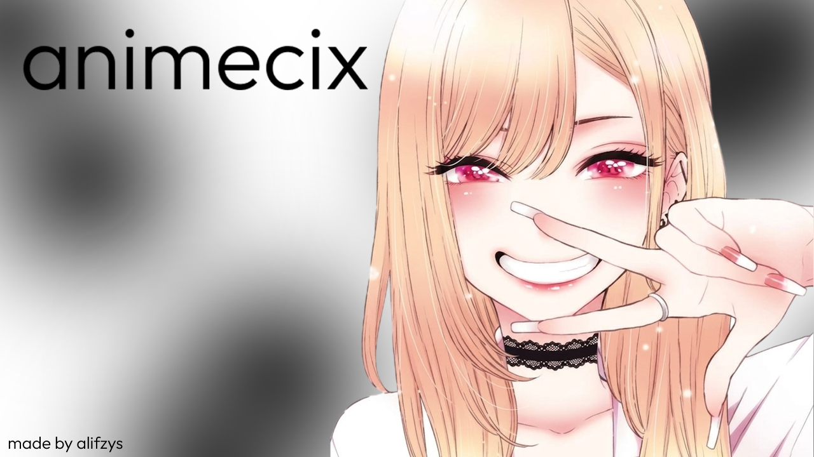
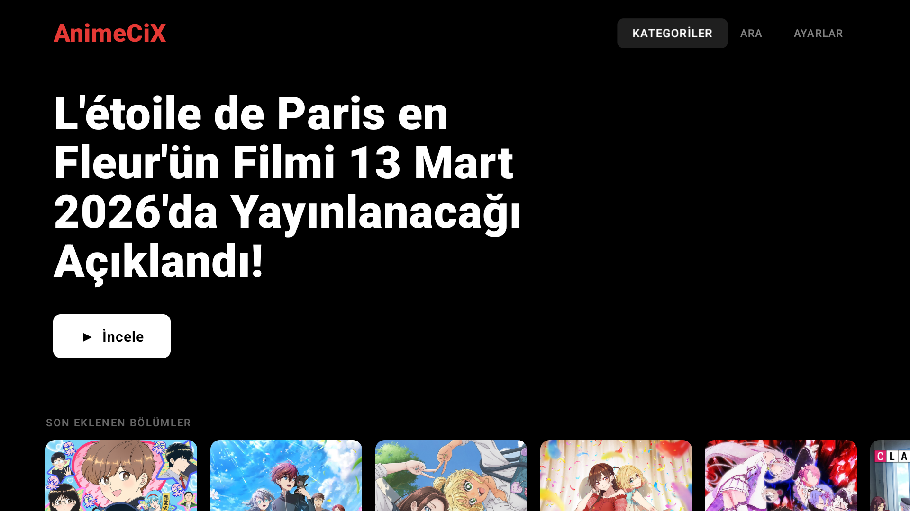
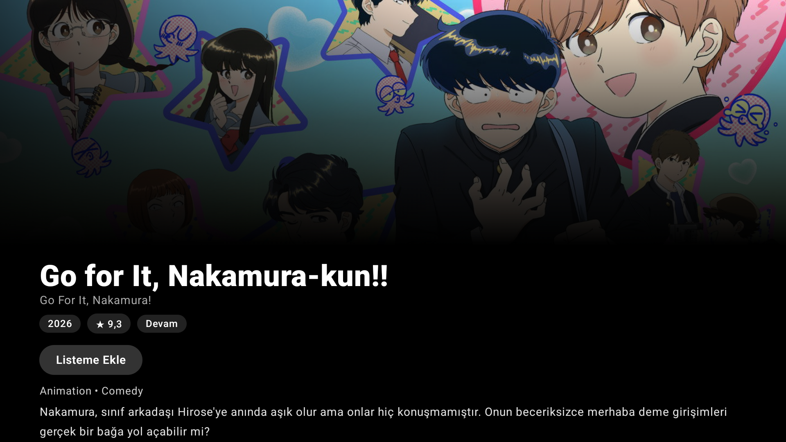
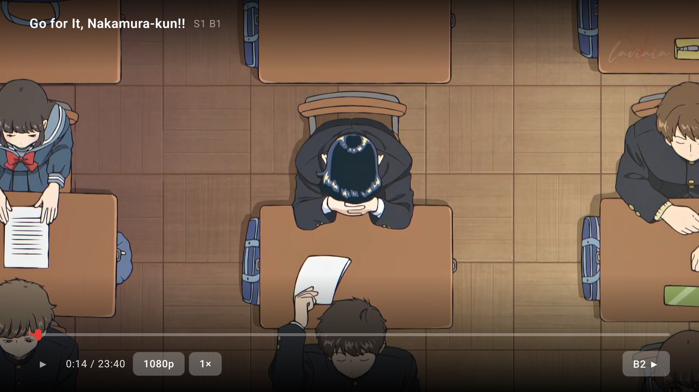
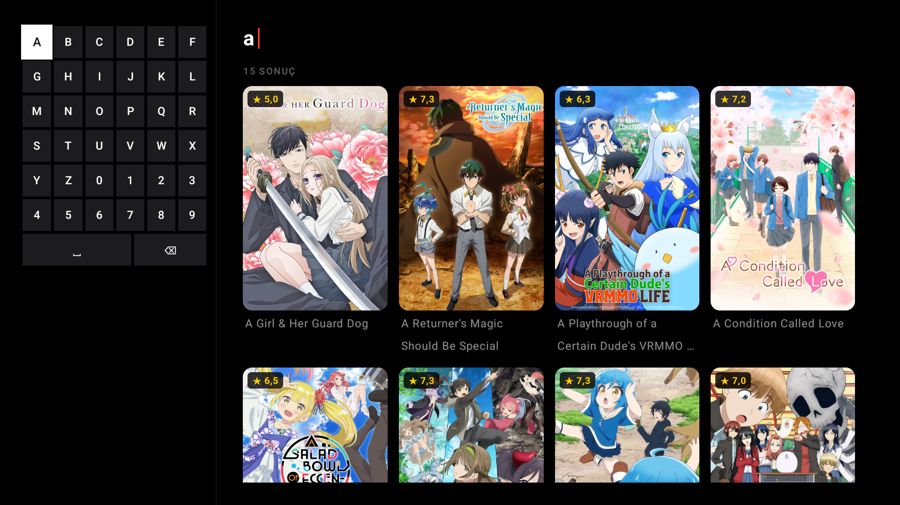

<div align="center">



# 📺 AnimeCiX TV

### Android TV & Google TV için anime izleme istemcisi

Kumandanla (D-pad) baştan sona kullanılabilen, akıcı ve şık bir arayüz.
Jetpack Compose for TV ile yazıldı.

<br>

[](https://github.com/alifzys/AnimeCiX-TV/actions/workflows/build.yml)
[](#)
[](LICENSE)
[](../../releases/latest)
[](#)

[**⬇️ İndir**](#-i̇ndir--kur) · [**✨ Özellikler**](#-özellikler) · [**🛠️ Derle**](#️-kaynaktan-derleme-geliştiriciler)

</div>

---

> [!WARNING]
> **Bu resmi bir uygulama değildir.** AnimeCiX TV, animecix.tv sitesi tarafından desteklenen, onaylanan
> veya onunla bağlantılı **resmi bir uygulama değildir**. Bağımsız geliştiriciler tarafından yapılmış
> **3. parti (unofficial) bir istemcidir**. Hiçbir içerik barındırmaz; yalnızca herkese açık
> animecix.tv uçlarını Android TV'de görüntülemek için bir arayüz sağlar. Eğitim ve kişisel
> kullanım amaçlıdır. Tüm içerik ve telif hakları sahiplerine aittir.

<br>

## ✨ Özellikler

🏠 **Ana Ekran** — Öne çıkan içerik vitrini, kategori satırları, son eklenen bölümler ve **kaldığın yerden devam et**

📺 **Detay Sayfası** — Puan, tür, süre, oyuncu kadrosu, benzer yapımlar, sezon/bölüm listesi ve kişisel **izleme listesi**

▶️ **Güçlü Oynatıcı** *(Media3 / ExoPlayer)*
- 🎚️ Kalite seçimi (480p / 720p / 1080p)
- 🌐 Fansub / kaynak seçimi
- ⏩ Oynatma hızı (0.5× – 2×)
- ⏭️ Opening / Ending **otomatik atlama** + sonraki bölüme **otomatik geçiş**
- ⏯️ Kaldığın yerden devam (konumu hatırlar)
- 🪄 **Görüntü iyileştirme** *(aşağıda ayrı bölüm)*

🔍 **Arama & Kategoriler** — Ekran üstü klavye, popüler animeler, arama geçmişi ve türlere göre tarama

🔄 **Otomatik güncelleme** — Yeni sürüm çıktığında uygulama açılışta kendini günceller (GitHub Releases üzerinden)

⚙️ **Ayarlar** — Varsayılan kalite, otomatik atlama, görüntü iyileştirme modu ve daha fazlası

<br>

## 🪄 Görüntü İyileştirme

[Anime4K](https://github.com/bloc97/Anime4K), anime/çizgi içeriği gerçek zamanlı keskinleştiren ve
yukarı ölçekleyen (upscale) açık kaynak bir shader algoritmasıdır. AnimeCiX TV bunu doğrudan
oynatma sırasında, GPU üzerinde çalışan bir GL shader hattıyla uygular — düşük çözünürlüklü
kaynaklar daha net ve canlı görünür.

**Modlar** *(Ayarlar → Görüntü İyileştirme)*:

| Mod | Ne yapar? |
|-----|-----------|
| **Kapalı** | İyileştirme yok (en düşük yük). |
| **Keskinlik** | Hafif, kaynak çözünürlükte keskinleştirme. Çoğu TV'de rahat çalışır. |
| **Anime4K** | ~1.5× upscale + güçlü keskinleştirme + çizgi belirginleştirme. En iyi görüntü, en yüksek GPU yükü. |

> ⚡ **Performans notu:** Anime4K GPU yoğundur; zayıf/eski TV'lerde takılmaya yol açabilir.
> Kasma yaşarsan **Keskinlik**'e geç veya kapat. Mod değişikliği için bölümü yeniden açman gerekir.

<br>

## 🖼️ Ekran Görüntüleri

| Ana Ekran | Detay Sayfası |
|:---:|:---:|
|  |  |
| **Oynatıcı** | **Arama** |
|  |  |

<br>

## ⬇️ İndir & Kur

### 1) APK'yı indir
[**📦 En son sürüm (Releases)**](../../releases/latest) sayfasından TV'ne uygun dosyayı indir:

| Dosya | Kimin için? |
|------|-------------|
| **`universal`** | 🟢 **Emin değilsen bunu indir** — her ARM TV'de çalışır |
| **`arm64-v8a`** | Yeni / 64-bit TV'ler |
| **`armeabi-v7a`** | Eski / 32-bit TV'ler |

### 2) TV'ye kur

**A) Dosya yöneticisiyle (en kolay):**
1. APK'yı bir USB belleğe at veya TV'ye indir
2. TV'de bir dosya yöneticisiyle APK'yı aç
3. "Bilinmeyen kaynaklara izin ver" çıkarsa onayla → **Yükle**

**B) ADB ile (bilgisayardan):**
```bash
adb connect <TV_IP>:5555
adb install -r AnimeCiX-TV-1.1.1-universal.apk
```

> 💡 Zayıf TV'lerde takılma yaşarsan release sürümünü kullandığından emin ol — R8 optimizasyonu sayesinde belirgin şekilde daha akıcıdır.

<br>

## 🎮 Kullanım

Tamamen kumanda ile çalışır:

| Tuş | İşlev |
|-----|-------|
| **Yön tuşları** | Gezinme |
| **OK / Seç** | Aç / oynat-duraklat |
| **◀ ▶ (oynatıcıda)** | Geri / ileri sar |
| **▼ (oynatıcıda)** | Kontrol butonlarına geç |
| **Geri** | Önceki ekran |

<br>

## 🛠️ Kaynaktan Derleme (Geliştiriciler)

**Gereksinimler:** JDK 17 · Android SDK 35 · Android Studio (Ladybug+) *ya da* komut satırı

```bash
# 1) Android SDK yolunu tanımla (Android Studio kullanmıyorsan)
echo "sdk.dir=/ANDROID/SDK/YOLU" > local.properties

# 2) Release APK derle
./gradlew assembleRelease
# Çıktı: app/build/outputs/apk/release/

# 3) TV'ye kur
adb install -r app/build/outputs/apk/release/app-universal-release.apk
```

Derleme **32-bit, 64-bit ve universal** olmak üzere üç APK üretir. Debug için: `./gradlew assembleDebug`.

### Teknolojiler
`Kotlin` · `Jetpack Compose for TV` · `Media3 / ExoPlayer` *(+ GL shader pipeline)* · `OkHttp` · `kotlinx.serialization` · `Room` · `Coil`
**minSdk** 23 · **target/compile SDK** 34 / 35

### Paket adı
`com.alifzys.an1mecix` — resmi animecix uygulamasından ayırt edilebilmesi için bilinçli olarak farklıdır.

<br>

## 📄 Lisans & Sorumluluk

Kaynak kodu **[MIT](LICENSE)** lisansı altındadır © 2026 alifzys.

Bu proje hiçbir içeriği barındırmaz veya dağıtmaz; yalnızca herkese açık animecix.tv uçlarına istek atar.
Erişilen içerik ve veriler animecix.tv'ye aittir ve MIT lisansının kapsamı dışındadır. Geliştiriciler,
uygulamanın kullanımından doğabilecek sonuçlardan sorumlu değildir.

<div align="center">

<br>

**❤️ ile yapıldı** · Beğendiysen repoya ⭐ bırakmayı unutma!

</div>
